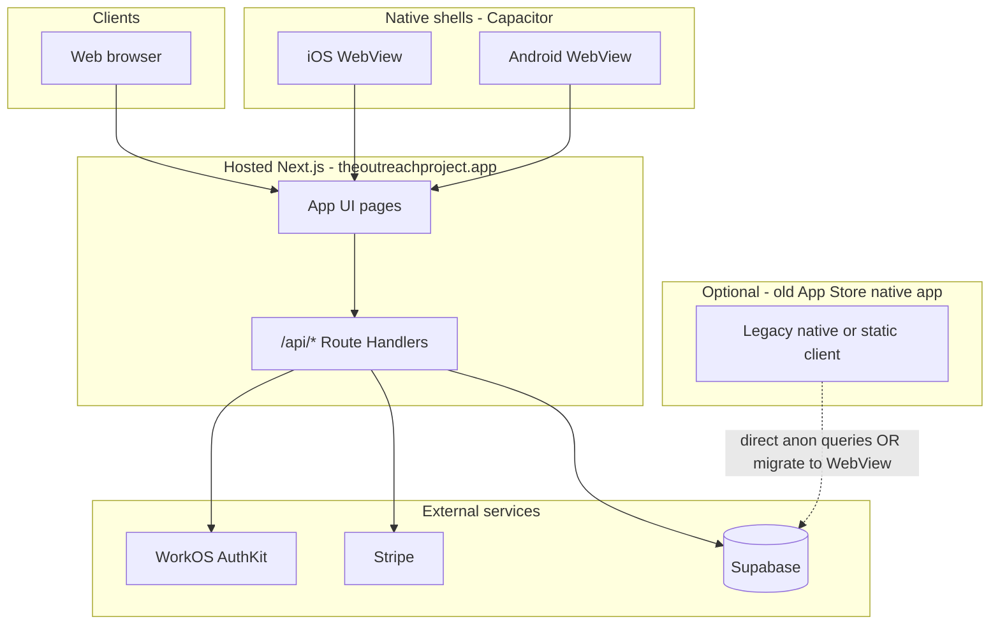

# Connecting web and mobile to the existing App Store experience (data layer)

This guide explains how **top-app-v2** (Next.js web + Capacitor iOS/Android) relates to the **legacy mobile-style experience** that shipped with the original App Store product, and how to connect both to the **same backend data** without maintaining two separate APIs.

---

## 1. What “the existing mobile API” actually is

The repo does **not** contain a separate REST service named “mobile API.” The App Store app historically behaved like a **mobile-only client** that talked **directly to Supabase** from the device:

| Layer | Legacy reference (`app.js` at repo root) | Current product (`web/`) |
|--------|------------------------------------------|---------------------------|
| UI | Static HTML + in-browser JS | Next.js App Router + React |
| “API” | Supabase PostgREST (anon key in client) | **Next.js Route Handlers** under `/api/*` + Supabase **server-side** (service role) |
| Directory | Table/view `nonprofits_search_app_v1` | `POST /api/directory/search` (same underlying object when configured) |
| Profile | `localStorage` (`top_profile_v3`) + optional `top_app_user_profiles` | `top_profiles` keyed by **WorkOS user id** via `GET/PATCH /api/me` |
| Auth | Demo / local only in legacy script | **WorkOS AuthKit** (cookies) |
| Membership | Demo toggle in legacy script | **Stripe** webhooks → `top_profiles` |

So “connecting to the existing mobile API” really means:

1. **Align both clients on the same Supabase project, tables, and RLS policies**, and  
2. **Choose whether the App Store binary keeps calling Supabase directly** or **calls your Next.js origin** (recommended for auth, billing, and admin parity).

---

## 2. Target architecture (recommended)



**Recommended for web + new store builds:** Capacitor loads your **production Next URL** (`CAP_SERVER_URL`). The WebView uses the **same UI and same `/api/*` endpoints** as the browser. No second mobile API to build.

References:

- Capacitor setup: [web/docs/CAPACITOR_MOBILE.md](../web/docs/CAPACITOR_MOBILE.md)
- Production mobile checklist: [mvp-production-launch.md](./mvp-production-launch.md) §9
- Auth/cookies for WebView: [production-auth.md](./production-auth.md), [workos-auth-setup.md](./workos-auth-setup.md)

---

## 3. Two integration strategies

### Strategy A — Capacitor WebView (preferred; already in repo)

**Use when:** You control the App Store listing and can ship `org.theoutreachproject.top` built from `web/ios` and `web/android`.

| Step | Action |
|------|--------|
| 1 | Deploy Next.js to Production (`https://theoutreachproject.app`). |
| 2 | Point Capacitor at that origin (see §5). |
| 3 | Register WorkOS redirect URIs and `WORKOS_COOKIE_DOMAIN` for the apex domain. |
| 4 | Submit the Capacitor build to App Store Connect / Play Console. |

The “mobile API” is simply **`https://theoutreachproject.app/api/...`** with session cookies — identical to web.

### Strategy B — Keep a separate native App Store app on Supabase

**Use when:** An older **native** (Swift/Kotlin) binary must keep running during migration and cannot yet use a WebView shell.

| Step | Action |
|------|--------|
| 1 | Confirm which Supabase project and tables the legacy app uses (compare with `app.js` constants). |
| 2 | Apply the same Supabase migrations as Production (`web/supabase/*.sql`). |
| 3 | Map legacy profile storage to `top_profiles` or add a **compatibility view** (§6). |
| 4 | Plan cutover: TestFlight WebView build → replace listing → retire direct anon access where possible. |

Long term, Strategy A avoids duplicating business logic (Stripe tiers, community moderation, admin grants) in native code.

### Strategy C — Next.js as a compatibility BFF for legacy native

**Use when:** The native app must call **HTTPS JSON endpoints** you control, but you do not want it to hold the Supabase service role or duplicate RLS.

Implement thin routes under `web/src/app/api/mobile/v1/...` that:

- Authenticate with a **mobile API key** or **WorkOS token** (not the public anon key in the binary).
- Proxy to the same server helpers used by `/api/me`, `/api/directory/search`, etc.

This repo does **not** ship those routes today; add them only if Strategy B cannot be retired soon.

---

## 4. Shared data contract (legacy ↔ current)

### 4.1 Directory / nonprofit search

| Legacy (`app.js`) | Current (`web/`) |
|-------------------|------------------|
| `DIRECTORY_SOURCE = "nonprofits_search_app_v1"` | `web/src/features/directory/api.js` + `POST /api/directory/search` |
| Client-side Supabase filters | Server-side search with same filters |

**Action:** Ensure Production Supabase has `nonprofits_search_app_v1` (table or view). See [web/supabase/README_SETUP.md](../web/supabase/README_SETUP.md).

**Web/mobile test:**

```bash
curl -s -X POST "https://theoutreachproject.app/api/directory/search" \
  -H "Content-Type: application/json" \
  -d '{"q":"","state":"","page":1,"pageSize":10}'
```

(Anonymous search may be allowed; confirm route auth in `web/src/app/api/directory/search/route.js`.)

### 4.2 Profile and saved organizations

| Legacy | Current |
|--------|---------|
| `PROFILE_KEY` / `top_profile_v3` in localStorage | `top_profiles` + `GET /api/me` |
| `FAV_KEY` / favorites array locally | `GET/PUT /api/me/saved-orgs` |
| `top_app_user_profiles` (optional Supabase table) | `top_profiles` with `workos_user_id` |

**Action for parity:**

1. Run profile migrations: [production-supabase-migration-order.md](./production-supabase-migration-order.md).
2. Do **not** set `NEXT_PUBLIC_PROFILE_TABLE=top_app_user_profiles` on Production (see `web/.env.local.example`).
3. Migrate legacy rows: copy `top_app_user_profiles` → `top_profiles` only after you have a stable `workos_user_id` per email (WorkOS sign-in or admin script).

### 4.3 Auth

| Legacy | Current |
|--------|---------|
| No WorkOS | WorkOS AuthKit; session cookie on `theoutreachproject.app` |
| Demo membership in JS | Stripe + `membership_tier` / `membership_status` on profile row |

**Web + Capacitor:** Users sign in through WorkOS on the loaded origin. Configure:

- `NEXT_PUBLIC_WORKOS_REDIRECT_URI` = `https://theoutreachproject.app/callback`
- `WORKOS_COOKIE_DOMAIN` = `theoutreachproject.app` (no leading dot)
- WorkOS Dashboard → Production → Redirect URIs + Organization membership

**Legacy native:** Cannot reuse WorkOS cookies unless it opens a **system browser / ASWebAuthenticationSession** to the same callback URL, then exchanges session — same pattern as Capacitor WebView, which is why WebView is simpler.

### 4.4 Features only in the new stack

These require Next `/api/*` (or server logic), not raw Supabase anon access:

- Community posts (`/api/community/posts`)
- Stripe membership (`/api/billing/*`)
- Podcast pipeline (`/api/podcasts/*`, admin sync)
- Platform admin (`/admin`, admin-only APIs)
- Trusted resources catalog (`/api/trusted/catalog`)

---

## 5. Connect Capacitor mobile (step-by-step)

### 5.1 Prerequisites

- Production web live and smoke-tested ([mvp-production-launch.md](./mvp-production-launch.md) §7).
- Node ≥ 22 for Capacitor CLI.
- macOS + Xcode (iOS); Android Studio (Android).
- Apple Developer / Google Play accounts for store upload.

### 5.2 Point the native shell at Production

From **repository root**:

```bash
pnpm --dir web run mobile:prep:prod
```

This sets `CAP_SERVER_URL=https://theoutreachproject.app`, runs `pnpm run build`, then `cap sync`.

Equivalent manual steps:

```bash
cd web
# PowerShell
$env:CAP_SERVER_URL="https://theoutreachproject.app"
pnpm exec cap sync
```

Config file: [web/capacitor.config.js](../web/capacitor.config.js) — when `CAP_SERVER_URL` is set, `server.url` is the WebView entry point.

### 5.3 Open native IDEs and run

```bash
pnpm --dir web run cap:open:ios      # macOS only
pnpm --dir web run cap:open:android
```

### 5.4 WorkOS and cookies on device

On a **physical device**, the WebView origin is `https://theoutreachproject.app`, so:

- Redirect URI `https://theoutreachproject.app/callback` must be registered in WorkOS.
- `WORKOS_COOKIE_DOMAIN=theoutreachproject.app` must be set on Vercel Production.

Smoke on device (from [mvp-production-launch.md](./mvp-production-launch.md) §9.3):

- Sign in / sign out  
- Profile load after cold start  
- Edit profile → save (`PATCH /api/me/profile`)  
- One membership checkout  
- Directory search  

### 5.5 QA / Preview mobile testing

Use your QA hostname instead of Production:

```bash
$env:CAP_SERVER_URL="https://qa.theoutreachproject.app"
cd web
pnpm exec cap sync
```

Register the QA callback in **WorkOS Staging** and set Preview env vars per [admin-qa-production-setup.md](./admin-qa-production-setup.md).

### 5.6 Local dev on emulator

| Target | `CAP_SERVER_URL` |
|--------|------------------|
| Android emulator → host machine | `http://10.0.2.2:3001` (if `pnpm dev` on port 3001) |
| iOS simulator → host machine | `http://localhost:3001` |
| Physical device on Wi‑Fi | `http://<your-LAN-IP>:3001` |

Use **HTTP** only on trusted dev networks; Production must be **HTTPS**.

Add the same origin (including port) to WorkOS **Staging** redirect URIs when testing auth.

---

## 6. Connect the web app (step-by-step)

The browser app **is** the Next deployment; it already uses the BFF.

### 6.1 Environment

1. Copy [web/.env.local.example](../web/.env.local.example) → `web/.env.local`.
2. Set Supabase, WorkOS, and Stripe keys for the target environment.
3. Run from repo root:

```bash
pnpm install
pnpm dev
```

Open http://localhost:3001.

### 6.2 Verify backend health

| Check | URL / command |
|-------|----------------|
| Auth config | `GET /api/auth/status` |
| Session + profile | `GET /api/me` (after sign-in) |
| Directory | Use Directory tab or `POST /api/directory/search` |
| Capabilities | `GET /api/billing/capabilities` |

### 6.3 Production

Mirror [vercel-production-env.template](./vercel-production-env.template) in Vercel Production. Redeploy after any `NEXT_PUBLIC_*` change.

---

## 7. Key `/api/*` endpoints (unified web + mobile WebView)

Mobile WebView and browser share these routes (non-exhaustive; member-facing):

| Area | Methods | Path |
|------|---------|------|
| Session / profile | GET | `/api/me` |
| Profile update | PATCH | `/api/me/profile` |
| Avatar upload | POST | `/api/me/avatar` |
| Saved orgs | GET, PUT | `/api/me/saved-orgs`, `/api/me/saved-orgs/cards` |
| Favorites (entities) | GET, PUT | `/api/me/favorites` |
| Directory | POST | `/api/directory/search` |
| Community | GET, POST | `/api/community/posts` |
| Billing | POST | `/api/billing/checkout`, `/api/billing/portal` |
| Podcasts | GET | `/api/podcasts/recent`, `/api/podcasts/upcoming`, … |
| Auth | GET | `/api/auth/workos/signin`, `/callback` |
| Config probe | GET | `/api/auth/status` |

All requests from the WebView must use **`credentials: "include"`** where cookies are required (the React app already does this in `useProfileData`).

---

## 8. Supabase alignment checklist

Use one Supabase project per environment (QA vs Production).

- [ ] `nonprofits_search_app_v1` exists and returns rows used by directory UI.  
- [ ] `top_profiles` and related migrations applied ([production-supabase-migration-order.md](./production-supabase-migration-order.md)).  
- [ ] RLS policies allow **server** access via `SUPABASE_SERVICE_ROLE_KEY` on Vercel (never expose service role in mobile binaries).  
- [ ] Legacy `top_app_user_profiles` either migrated or left read-only for old clients only.  
- [ ] Storage bucket `profile-photos` (if using avatar upload) exists and policies match [web/src/app/api/me/avatar/route.js](../web/src/app/api/me/avatar/route.js).  

---

## 9. Replacing the App Store listing with the new shell

| Phase | Activity |
|-------|----------|
| 1 | Ship Production web (sections 1–7 in [mvp-production-launch.md](./mvp-production-launch.md)). |
| 2 | Internal TestFlight / Play internal testing with `mobile:prep:prod`. |
| 3 | Match **bundle ID** `org.theoutreachproject.top` in App Store Connect (or create new listing if ID changes). |
| 4 | Use copy from [store-listing-copy.md](./store-listing-copy.md). |
| 5 | After approval, monitor WorkOS sign-in and Stripe on real devices. |
| 6 | Deprecate direct Supabase anon usage in any remaining legacy binary; rotate anon key if it was embedded in old builds. |

If the **bundle ID** changes, users get a **new** App Store app; plan communication and data migration accordingly.

---

## 10. Security notes

1. **Never ship `SUPABASE_SERVICE_ROLE_KEY` in mobile or browser bundles.** Only Vercel/server uses it.  
2. **Avoid embedding long-lived Supabase anon keys in new native code**; prefer the Next BFF.  
3. **Rotate keys** if the legacy `app.js` anon key was ever public in a shipped binary.  
4. **WorkOS Production** keys only on Production Vercel; Staging on Preview/QA.  
5. **Stripe webhooks** must point to Production: `https://theoutreachproject.app/api/billing/webhook` ([stripe-webhooks.md](./stripe-webhooks.md)).  

---

## 11. Troubleshooting

| Symptom | Likely cause | Fix |
|---------|----------------|-----|
| Mobile WebView shows “configure CAP_SERVER_URL” | `CAP_SERVER_URL` unset at `cap sync` | Re-run `mobile:prep:prod` or set env and `cap sync` |
| Sign-in works on web, fails in app | Missing redirect URI or cookie domain | WorkOS Staging/Production redirects; `WORKOS_COOKIE_DOMAIN` |
| Directory empty | Missing `nonprofits_search_app_v1` | Supabase object + seed/ETL |
| Profile save 401 | Org/session mismatch | WorkOS org membership; see `/api/me` vs PATCH errors |
| Legacy app data not in new app | Different Supabase project or profile table | Align env URLs/keys; migrate `top_profiles` |
| Stripe works on web, not mobile | WebView blocked third-party cookies rare on iOS | Use same apex HTTPS origin; test in-app checkout return URL |

CLI helpers:

```bash
pnpm --dir web run verify:workos-auth
pnpm --dir web run smoke:qa:http
```

---

## 12. Related documentation

| Doc | Topic |
|-----|--------|
| [web/docs/CAPACITOR_MOBILE.md](../web/docs/CAPACITOR_MOBILE.md) | Capacitor scripts, caveats, sync |
| [mvp-production-launch.md](./mvp-production-launch.md) | End-to-end launch including §9 mobile |
| [workos-auth-setup.md](./workos-auth-setup.md) | WorkOS redirect URIs and env |
| [deployment-domains.md](./deployment-domains.md) | Apex, www, admin, QA hosts |
| [environment.md](./environment.md) | QA vs Production principles |
| [web/docs/profile-auth-data-sync.md](../web/docs/profile-auth-data-sync.md) | Profile `/api/me` flow |
| Root [app.js](../app.js) | Legacy direct-Supabase reference implementation |

---

## 13. Summary

- The **existing App Store “mobile API”** is best understood as **Supabase + client-side queries**, as in root `app.js`.  
- **Web and new mobile** should share **one Next.js deployment** and its **`/api/*` routes**; Capacitor only wraps that URL.  
- **Do not build a second mobile-only API** unless you must support an old native binary during transition; prefer WebView + `CAP_SERVER_URL`, then retire direct anon access.  
- Align **Supabase schema** (`nonprofits_search_app_v1`, `top_profiles`) and **WorkOS/Stripe** on Production before store submission.

For implementation questions (new `/api/mobile/v1` proxies, migration SQL, or WorkOS in pure native), extend this doc with your actual legacy bundle ID, Supabase project ref, and API inventory from the old repository.
