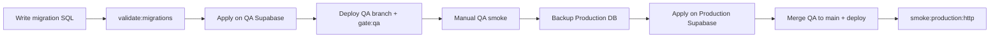

# Phase 9 — Database migration safety

**Date:** 2026-06-15

## Rules

1. **Apply migrations in QA Supabase first** — verify app on QA branch against new schema.
2. **Production migration requires backup** — Supabase Dashboard → Database → Backups (or PITR on Pro plan).
3. **Prefer backward-compatible migrations** — add columns nullable first; deploy code; then backfill; then constrain.
4. **Do not deploy code requiring tables/columns missing in production** — ship migration before or with code.
5. **Rollback notes required** for risky changes — document in migration file header.
6. **Seed data must never overwrite production user data** — seeds target catalogs/demo rows only.

## Migration order

Follow `docs/production-supabase-migration-order.md` for production apply sequence.

## Static safety check

```bash
pnpm --dir web run validate:migrations path/to/new_migration.sql
```

Flags:

- `DROP TABLE`, `DROP COLUMN`, `TRUNCATE`
- Deletes from `top_profiles` or `auth.*`
- Warns on `ALTER NOT NULL`, renames, missing rollback notes

## Workflow



## App deploy vs migration ordering

| Change type | Order |
|-------------|-------|
| Add optional column | Migration first, then code |
| Remove column | Code stop using first, then migration |
| Rename column | Dual-write period or single maintenance window |
| New table required by code | Migration **before** code deploy |

## Seed scripts

| Script | Safe for production? |
|--------|---------------------|
| `seed:sponsors` | Yes — catalog only (verify idempotent) |
| `seed:local-dev` | **No** — local only |
| `seed:qa-community-demo` | **No** — QA only |

## Rollback examples

Document in each migration file:

```sql
-- ROLLBACK: alter table public.foo drop column if exists bar;
-- ROLLBACK: drop table if exists public.new_table;
```

For destructive changes, keep a copy of pre-migration row counts:

```sql
select count(*) from public.top_profiles;
```
