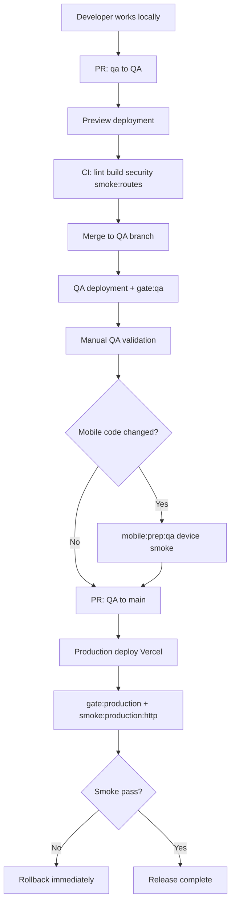

# Phase 7 — Release workflow

**Date:** 2026-06-15

## Required path (no direct production edits)



## Step-by-step

### 1. Local development

```bash
pnpm install
pnpm dev
pnpm --dir web run smoke:routes
pnpm build
```

### 2. Pull request (`qa` → `QA`)

- CI runs: security, lint, build, route smoke, env structure, Capacitor validate.
- Vercel creates Preview deployment for the PR.

### 3. Merge to `QA`

- Stable QA URL updates: `https://qa-the-outreach-project.vercel.app`
- Automated: `release-gates.yml` runs `smoke:qa:http`

```bash
VERCEL_AUTOMATION_BYPASS_SECRET=… pnpm --dir web run gate:qa
```

### 4. Manual QA validation

- Sign-in / sign-up / logout
- Profile, membership, community post
- Trusted resources browse
- Admin content edit (draft → approved on QA only)
- Stripe test checkout (if configured)

### 5. Mobile validation (if Capacitor/native changed)

```bash
pnpm --dir web run mobile:prep:qa
# Device smoke: auth, profile cold start, billing
```

Before store release:

```bash
pnpm --dir web run mobile:prep:prod
pnpm --dir web run mobile:verify:prod
```

### 6. Pull request (`QA` → `main`)

- `pr-branch-flow.yml` enforces target branch.
- Full CI re-runs on PR.

### 7. Production deploy

- Merge to `main` → Vercel Production build.
- `prebuild` runs strict production env validation.
- `release-gates.yml` runs `gate:production` + live HTTP smoke.

### 8. Post-deploy verification

```bash
pnpm --dir web run smoke:production:http
```

Watch first hour: Vercel logs, Stripe webhook deliveries, `/api/health`.

### 9. Rollback if smoke fails

See [ROLLBACK_PLAN.md](./ROLLBACK_PLAN.md).

## Emergency hotfix

Only when production is down and QA path is too slow:

1. Document incident in `docs/PRODUCTION_STABILITY_INCIDENT.md`
2. Minimal fix on `qa` → fast-track `QA` → `main`
3. Run `gate:production` before merge
4. Post-deploy smoke; rollback if fail

## Branch protection (recommended GitHub settings)

| Branch | Require PR | Required checks |
|--------|------------|-----------------|
| `QA` | From `qa` only | `CI / lint-and-build`, `CI / security` |
| `main` | From `QA` only | `CI / lint-and-build`, `Release Gates / production-gates` |

## npm commands reference

| Command | When |
|---------|------|
| `gate:qa` | Before approving QA → main PR |
| `gate:production` | Before production merge; CI on main |
| `smoke:qa:http` | After QA deploy |
| `smoke:production:http` | After production deploy |
| `validate:migrations <file.sql>` | Before applying SQL to production |
